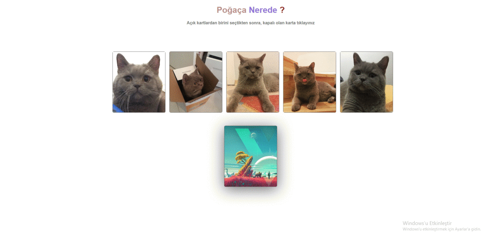

# catmem

## Project setup

```
npm install
```

### Compiles and hot-reloads for development

```
npm run serve
```

### Compiles and minifies for production

```
npm run build
```

### Lints and fixes files

```
npm run lint
```

### Customize configuration

See [Configuration Reference](https://cli.vuejs.org/config/).



Udemy kablosuz kedi kurslarında izlenilen uygulamalar.
Satın almak için : (https://www.udemy.com/course/sifirdan-ileri-seviye-vuejs-2-vuex-vue-router-egitim-seti/)
